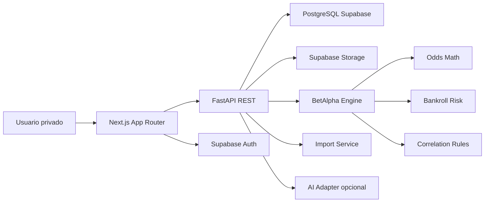

# Architecture

BetAlpha Manager es una aplicación privada de apoyo a decisiones para apuestas deportivas con valor esperado. No ejecuta apuestas, no pide credenciales de casas de apuestas y no promete rentabilidad.

## Stack

- Frontend: Next.js App Router, TypeScript, Tailwind CSS, TanStack Query, React Hook Form, Zod y Recharts.
- Backend: FastAPI, Pydantic, SQLAlchemy 2, Alembic, servicios desacoplados.
- Base de datos: PostgreSQL en Supabase para producción; SQLite local permitido para desarrollo rápido.
- Auth: Supabase Auth. El backend confía en JWT de Supabase cuando esté configurado; en desarrollo permite un usuario demo explícito.
- Archivos: Supabase Storage en producción; adapter local para desarrollo.
- Despliegue: frontend en Vercel, backend FastAPI en servicio compatible, Supabase para DB/Storage.

## Diagrama

## Módulos backend

- `core`: configuración, logging, seguridad.
- `models`: entidades SQLAlchemy.
- `schemas`: contratos Pydantic.
- `services.odds`: cuotas, vig, EV, Kelly, parlays y CLV.
- `services.betalpha`: score, grading, stake y explicación.
- `services.bankroll`: exposición, liquidación y métricas.
- `services.imports`: CSV, validación e idempotencia.
- `services.correlation`: reglas heurísticas de tickets múltiples.
- `api.v1`: endpoints REST.

## Decisiones inmediatas

- No se copia código externo por licencias ausentes en dos referencias.
- MVP usa probabilidad manual y baseline de mercado sin vig; modelos predictivos reales quedan aislados detrás de `BaseSportModel`.
- Supabase Auth/Storage se modela desde el inicio, pero el desarrollo local funciona sin secretos.
- Kelly completo es informativo; stake recomendado usa Kelly fraccionado y límites conservadores.
- Parlays correlacionados requieren probabilidad conjunta manual o se degradan por riesgo.
