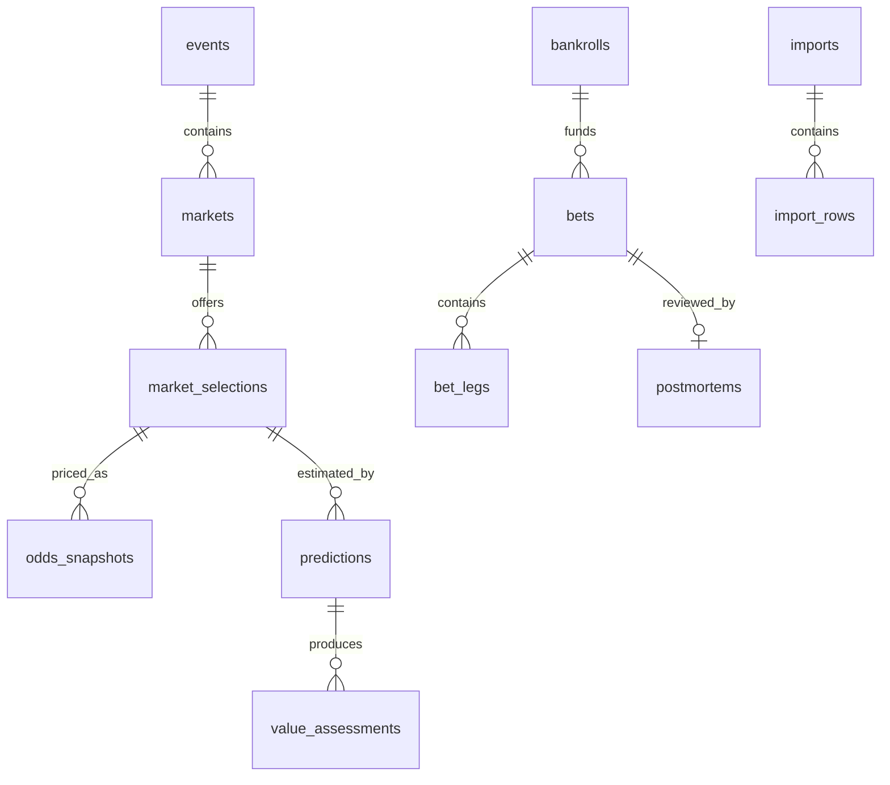

# Data Model

Todas las tablas privadas incluyen `user_id`, UUID, `created_at` y `updated_at` en UTC cuando aplica.

## Entidades principales

- `profiles`: preferencias públicas privadas del usuario autenticado.
- `sports`, `leagues`, `teams`: catálogo extensible por deporte.
- `events`: partidos/peleas con deporte, liga, equipos, hora y estado.
- `sportsbooks`: casas de apuestas, incluyendo Triunfobet como seed demo.
- `markets`: tipo de mercado, periodo, línea y reglas.
- `market_selections`: selección apostable dentro de un mercado.
- `odds_snapshots`: cuota capturada, formato, fuente, closing line y payload bruto.
- `model_registry`, `model_versions`: modelos versionados.
- `predictions`: probabilidad estimada con fuente, intervalo, features y explicación.
- `value_assessments`: fair odds, edge, EV, Kelly, stake, grade y warnings.
- `bankrolls`, `bankroll_transactions`: banca, movimientos y unidad.
- `bets`, `bet_legs`: tickets simples y múltiples.
- `bet_results`, `bet_settlements`: resultados y liquidaciones.
- `tags`, `bet_tags`: taxonomía flexible.
- `postmortems`: autopsia estructurada.
- `attachments`: capturas, CSV y adjuntos.
- `imports`, `import_rows`: importaciones y filas validadas.
- `alerts`: advertencias generadas por reglas.
- `user_preferences`: límites y defaults.
- `audit_logs`: acciones relevantes.

## Relaciones críticas



## RLS preliminar

Política base:

```sql
using (auth.uid() = user_id)
with check (auth.uid() = user_id)
```

Catálogos globales (`sports`, markets templates) pueden ser públicos de lectura y restringidos de escritura.
